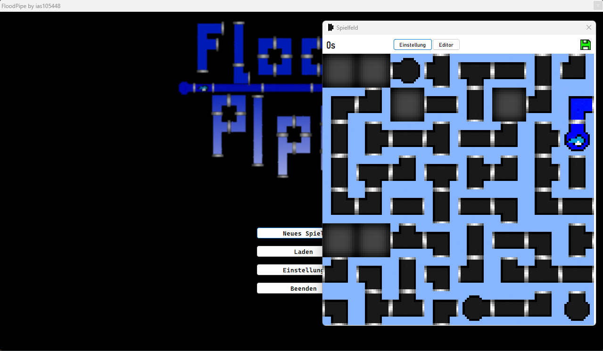

# FloodPipe

## Info
Im Verlauf meines dritten Semesters an der [BFS Wedel](https://bfs-wedel.de), wo ich mich auf den Beruf des Informationstechnischen Assistenten mit Schwerpunkt Softwaretechnik vorbereite, habe ich als schulische Aufgabe das Spiel FloodPipe entwickelt.

Die Implementierung erfolgte unter Verwendung der Programmiersprache Pascal, wobei darauf geachtet wurde, dass das Spiel nicht auf objektorientierter Programmierung (OOP) basiert.

## Ziel

Dein Ziel ist es, das gesamte Spielfeld mit Wasser zu fluten, indem du die Rohre so anordnest, dass sie miteinander verbunden sind. Dabei darf kein offenes Ende übrigbleiben.

## Dokumentation

In diesem Repository ist auch eine detaillierte [Dokumentation](/Dokumentation/) enthalten.

## Mindestanforderung

    Windows 32 bit

## Installation

Die Game EXE ist im Repository enthalten,
kann jedoch auch im [RAD Studio](https://www.embarcadero.com/de/products/rad-studio) mit dem Quelltext neu kompiliert werden.

Ich programmierte mit RAD Studio Embarcadero Version 10.4.
